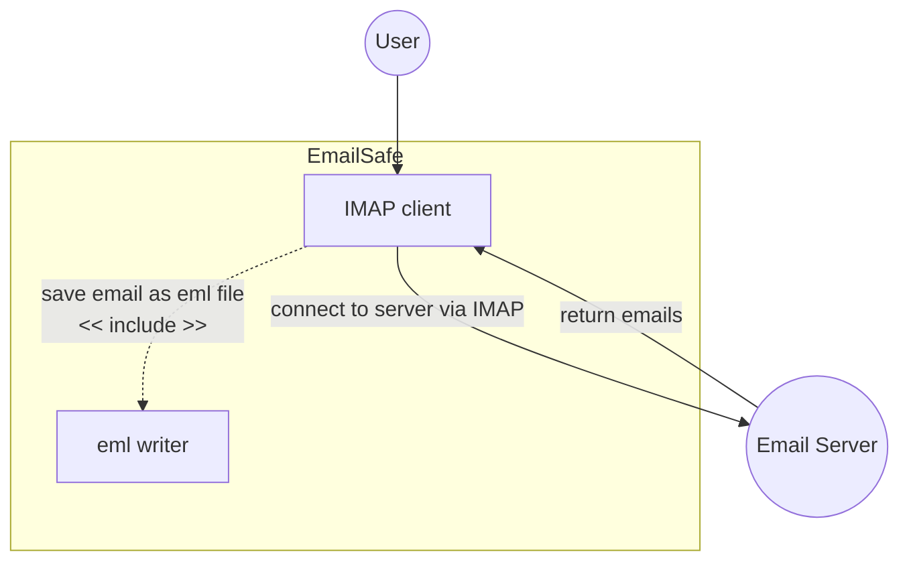
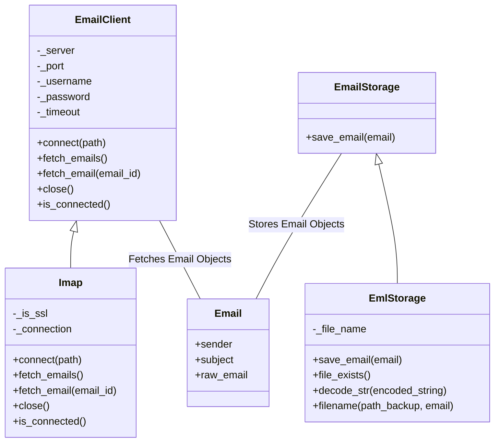

# Final Project for CS50's Introduction to Programming with Python: EmailSafe - Email Backup using IMAP

## Demo Video
> https://youtu.be/dxW7mLIFhio

## Project Description
The final project is an email backup tool that uses the Internet Message Access Protocol (IMAP) to fetch emails from a server. The emails are then saved to a local storage in `.eml` format.

## Requirements
- Python 3.7+
- `imaplib` and `email` libraries for IMAP server interaction and email handling.
- `argparse` library for command-line argument parsing.

## Setup
1. Clone the repository.
2. Install any necessary libraries (if not already installed).
3. Run the script from the command line using your IMAP server details.

## Usage
Here is an example of command-line usage:

```shell
python project.py --server imap.gmail.com --port 993 --username example@gmail.com --password yourpassword
```
Please replace `example@gmail.com` and `yourpassword` with your actual email server address and password respectively. Be sure to keep your credentials safe and secure.


## Usecase Diagram

The usecase diagram displays the interactions of the user with the system. The user provides IMAP server details (server address, port number, username, and password) to the system via command line argument. The system connects to the IMAP server, fetches emails from inbox folder in server, and then saves the emails to local storage.



## Class Diagram

The class diagram represents the structure of the system, displaying the classes, their attributes, and the relationships between them.



In the above diagram:

- `EmailClient` is a abstract class with basic attributes like `server`, `port`, `username`, `password` and methods like `connect()`, `fetch_emails()`, `fetch_email(email_id)`, `close()`, and `is_connected()`.
- `Imap` is a derived class from `EmailClient`, it contains additional private attributes like `_is_ssl` and `_connection`, and overrides the `connect(path)`, `fetch_emails()`, `fetch_email(email_id)`, `close()`, and `is_connected()` method.
- `EmailStorage` is a abstract class for storing email objects. It has the `save_email(email)` methods.
- `EmlStorage` is a derived class from `EmailStorage`,it contains additional private attributes like `_file_name`,and it overrides the `save_email(email)` method and have additional method `file_exits()`, `decode_str(encoded_string)`, `filename(path_backup, email)`.
- `Email` represents an email object, with `sender`, `subject`, `date`, and `raw_email` attributes. It interacts with `EmailClient` (to be fetched) and `EmailStorage` (to be stored).

> **NOTE:** This code is a sample implementation and is meant to be used for educational purposes. It may not cover all cases and may not be suitable for production environments.

